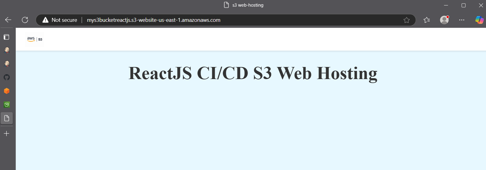
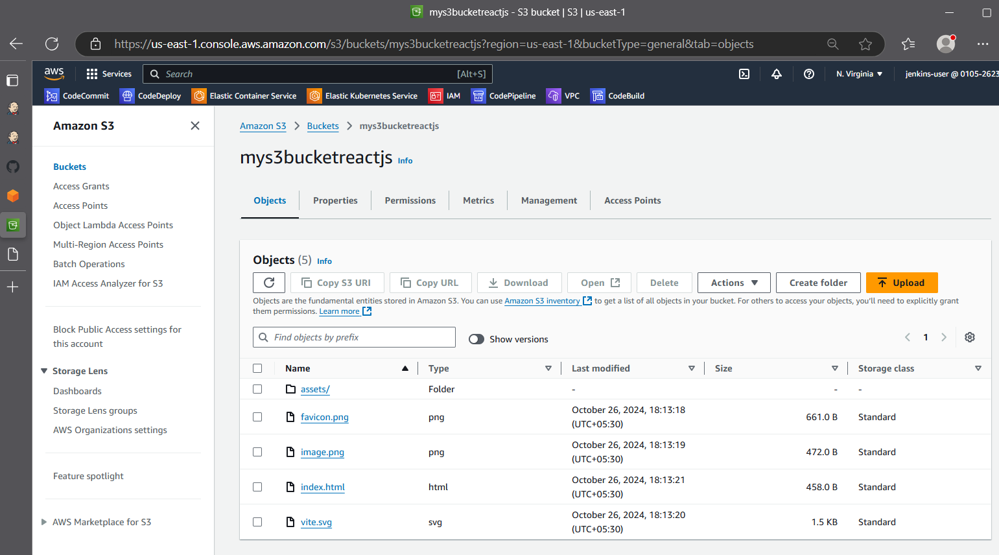
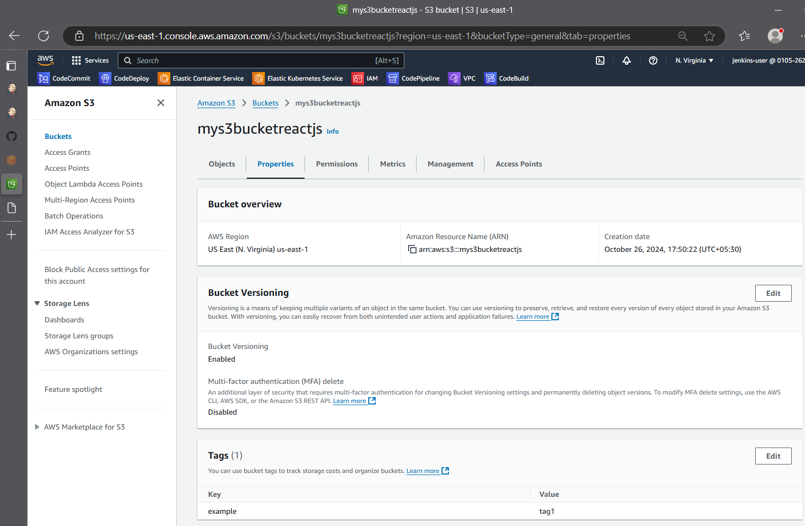
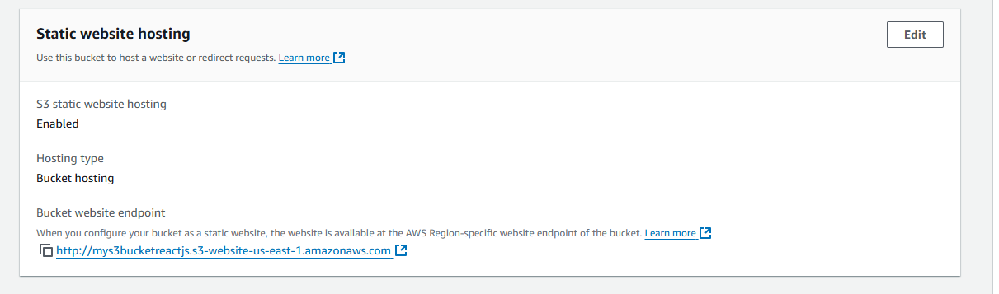
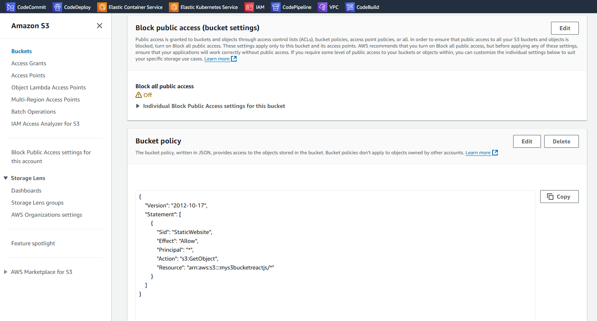

# React + Vite

This template provides a minimal setup to get React working in Vite with HMR and some ESLint rules.

Currently, two official plugins are available:

- [@vitejs/plugin-react](https://github.com/vitejs/vite-plugin-react/blob/main/packages/plugin-react/README.md) uses [Babel](https://babeljs.io/) for Fast Refresh
- [@vitejs/plugin-react-swc](https://github.com/vitejs/vite-plugin-react-swc) uses [SWC](https://swc.rs/) for Fast Refresh

Steps 1. SCM Git Checkout from this public url 
https://github.com/Gaurav1517/ReactJs-app-CICD.git

Step 2. Install Nodejs plugins on jenkins dashboard .
Nodejs 
Restart the jenkins 
Get login once again on jenkins dashboard.
Go to this path Dashboard> Manage Jenkins > Tools > NodeJS installations
Add NodeJS > 
Name: 
Required

Install automatically
?
Install from nodejs.org
Version

NodeJS 23.4.1
For the underlying architecture, if available, force the installation of the 32bit package. Otherwise the build will fail

Force 32bit architecture
Global npm packages to install
Specify list of packages to install globally -- see npm install -g. Note that you can fix the packages version by using the syntax `packageName@version`
Global npm packages refresh hours
Duration, in hours, before 2 npm cache update. Note that 0 will always update npm cache
72
Save

From decleartive pipeline gnerator 
tools {
  nodejs 'nodejs'
}
Refer to Jenkinsfile for pipeline.

Create  a IAM role in aws for S3 
IAM role > Roles > Create Role > AWs service > Service Or use case: EC2 > EC2 > 
Next > AmazonS3FullAccess > Next
Role Name: s3-deploy-reactjs-cicd > Create Role
Policy name-
AdministratorAccess
AmazonEC2FullAccess
AmazonS3FullAccess

Note: "Block Public Access settings for this account" should be enable.

## Application Screenshot

